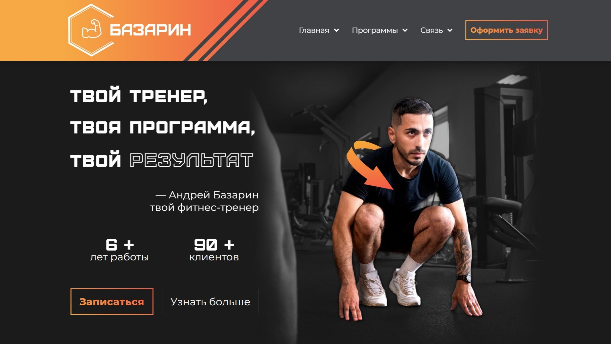

# Фитнес-тренер — React-приложение (дипломный проект)

<div align="right">
  
  
  
</div>

## Описание проекта

Данный проект представляет собой веб-сайт индивидуального фитнес-тренера, разработанный на React в рамках дипломной работы.  

Цели проекта:
* Создание современного, интерактивного сайта для увеличения потенциальной базы клиентов
* Знакомство с React-библиотекой
* Реализация адаптивного дизайна

## Стэк технологий и библиотек

* React
* React Hooks (useState, useEffect и др.)
* Стили: CSS (Flexbox, Grid, Media Queries)
* Иконки: FontAwesomeIcon
* Анимации и эффекты:  
react-awesome-reveal (появление элементов),  
framer-motion (плавные переходы),  
react-collapse (раскрывающиеся блоки),  
react-type-animation (анимация ввода текста)
* Слайдеры и UI-компоненты:  
swiper (карусель карточек),  
react-compare-slider (сравнение "до/после"),  
number-counter (анимированные счетчики)

## Содержание

Сайт состоит из "шапки" страницы, 9 блоков и "подвала":
* Фиксированное меню
* Приветствующий блок с призывом к действию (CTA)
* Информация о тренере (с раскрывающимся подблоком)
* Отзывы клиентов – сравнение "До/После"
* Призыв к действию в виде ответа на сообщение
* Карусель карточек с программами
* Свайпер формата занятий
* FAQ с раскрытием элементов
* Тарифы
* Форма записи с валидацией
* Контакты

## Установка и запуск

1. Клонировать репозиторий
```bash
git clone https://github.com/levrozhkov-dev/fitness-trainer-react.git
```
2. Установить зависимости
```bash
npm install
```
3. Запустить сервер
```bash
npm start
```

## Превью

<div align="center">
  
  
</div>